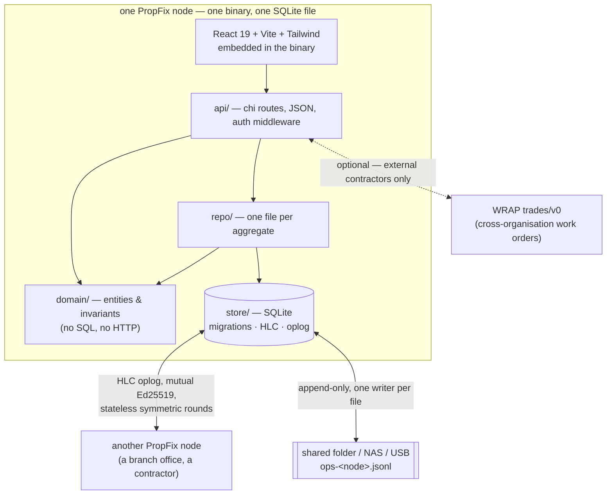

<div align="center">


# PropFix

### Building maintenance and inspections you actually own.

Raise a job against a unit, cost it, close it — and prove move-out damage with
ingoing/outgoing inspection comparison. **One static binary, one SQLite file.**
No cloud account, no subscription, no external service.

<sub> Part of <strong><a href="https://vulos.org">VulOS</a></strong> — the open, self-hostable web OS &amp; app suite. Runs standalone, or as an app hosted by the Vulos OS.</sub>

[](CHANGELOG.md)
[](LICENSE)
[](#status-read-this-first)
[](docs/SELFHOST.md)
[](docs/SYNC.md)
[](https://golang.org)
[](https://react.dev)

[**Architecture**](docs/ARCHITECTURE.md) · [**Getting started**](docs/GETTING-STARTED.md) · [**Sync**](docs/SYNC.md) · [**WRAP**](docs/WRAP.md) · [**Docs**](docs/) · [**Changelog**](CHANGELOG.md)

</div>

---

## Status — read this first

> [!WARNING]
> **PropFix is being rebuilt from scratch and is not usable software today.**
>
> A previous, cloud-coupled implementation existed; it is being replaced rather
> than patched (see [`SECURITY-AUDIT.md`](SECURITY-AUDIT.md) for why). At the
> time of writing, **`backend/` and `src/` contain no shipped code**, there is
> **no binary to run**, **no UI**, and **no release**.
>
> What exists today is the **design contract** in
> [`docs/ARCHITECTURE.md`](docs/ARCHITECTURE.md) and the documentation set
> around it. Every command, screenshot and feature below is marked with its
> real state. If something is not marked **Built**, it does not work yet.

| Legend | Meaning |
|---|---|
| ✅ **Built** | Implemented and runnable today |
| 🟡 **In progress** | Partially implemented; do not rely on it |
| 📐 **Designed** | Specified in `docs/ARCHITECTURE.md`, no code yet |

As of `0.1.0`, **every row in the Features table below is 📐 Designed.** There
is deliberately no ✅ in this README yet. Rows will be promoted as code lands,
and the promotion is part of the change that lands it — see
[§13 Status honesty](docs/ARCHITECTURE.md#13-status-honesty).

---

## What is PropFix?

PropFix is **building maintenance and inspection software for people who manage
property** — managing agents, landlords with a portfolio, body corporates, and
facilities teams. Raise a job against a unit, triage it, assign it, cost it,
close it, and report spend per building and per unit.

The differentiator is the second half: **templated condition inspections with
ingoing/outgoing comparison**, so damage liability at move-out is evidence-based
rather than argued.

The design target is **one static Go binary and one SQLite file**. A tablet, a
laptop, an office NAS or a Raspberry Pi is intended to be a complete deployment:
no cloud account, no subscription, no external service, and no account with us.
It is designed to accept writes while fully offline and converge afterwards, and
to require no central server — peers are enrolled by hand and sync directly.

*(All of the above is the contract being built to, not a description of running
software. See [Status](#status--read-this-first).)*

---

## Part of VulOS

**Vulos = free, open-source software + two paid services.** The Vulos OS, all
its apps (PropFix included), and the app store are **OSS and free — you
self-host them**. You self-provision and self-pay your own box (Fly / Hetzner /
any VPS / home server); Vulos does **not** host or provision boxes. Vulos bills
for only two things: **Vulos Relay** (reachability) and **backup storage**
(buckets). There is no compute/box billing, no mail billing, and no app-store
subscription.

VulOS is an open, self-hostable web OS + app suite. The **Vulos OS** is the
shell (launcher, windows, dock, assistant) that hosts the apps; each product
also runs independently on its own:

- **Vulos OS** — the web-native desktop shell that hosts the apps
- **Vulos Office** — documents: docs, sheets, slides, PDF, and **whiteboards**
  (the Excalidraw-based whiteboard is an Office **document type** — there is
  **no separate Board product**)
- **Vulos Files** — file storage + P2P sharing, built into the OS
- **Vulos Relay** — sovereign connectivity / reachability fabric
  (`@vulos/relay-client`) — one of the two paid services
- **llmux** — sovereign AI gateway

PIM is **bring-your-own** (Mail / Calendar / Contacts via lilmail + the OS's
Calendar/Contacts widgets); chat and video are **third-party** (Matrix/Element;
Element Call / Jitsi) — not Vulos products.

**PropFix's role:** the property maintenance and inspections app. It is designed
to run standalone **and** be hosted as an app by the Vulos OS — the same binary,
with the OS wiring identity and scoped storage in front of it. Relay, the
control plane and DMTAP are **optional seams only**; a hard runtime dependency
on any of them is forbidden by
[`VULOS-PRODUCT-STANDARD.md`](docs/ARCHITECTURE.md#2-non-negotiables).

---

## Features

| | Status | |
|---|---|---|
| 🔧 **Maintenance jobs** | 📐 Designed | Raise a job against a **unit**, triage, assign, cost, close. Per-building job number sequences allocated with no coordination. |
| 🏢 **Units as real entities** | 📐 Designed | Units are rows with a normalised `key` and a display `label`, not free text on the job — so "Flat 3A", "3A" and "flat 3a" cannot fragment per-unit cost reporting the way the legacy system did. |
| 📋 **Templated inspections** | 📐 Designed | Reusable checklists per building type; per-item condition, comment and photo capture. See [INSPECTIONS.md](docs/INSPECTIONS.md). |
| ⚖️ **Ingoing/outgoing comparison** | 📐 Designed | The differentiator: a move-out inspection diffed against the move-in one, item by item, so deposit deductions rest on captured evidence. |
| 💷 **Append-only money & hours** | 📐 Designed | `cost_entry` and `time_entry` rows are immutable and insert-only; a job's cost is `SUM(amount_minor)` at read time, never a stored counter. Corrections are negative entries. Money is `int64` minor units — floats never touch money. |
| 📴 **Offline-first** | 📐 Designed | Every surface is designed to accept writes while partitioned and converge afterwards. Nothing blocks on the network. |
| 🔗 **Peer-to-peer sync** | 📐 Designed | HLC oplog, stateless symmetric rounds, mutual Ed25519 auth, manual peer enrolment. No hub, no control plane. See [SYNC.md](docs/SYNC.md). |
| 💾 **Folder / USB transport** | 📐 Designed | Each node appends only its own `ops-<node>.jsonl` to a shared folder, so a NAS, a synced drive or a **USB stick** is a valid transport. |
| 🤝 **Cross-org dispatch over WRAP** | 📐 Designed | A contractor runs **their own** PropFix node and receives work orders over the open [WRAP](https://github.com/vul-os/wrap) `trades/v0` profile. No platform in the middle, no cut. Optional — in-house maintenance never touches it. See [WRAP.md](docs/WRAP.md). |
| 👤 **Tenants without accounts** | 📐 Designed | A tenant is a **participant, not an account** — attached to a unit or job, seeing only `visibility = 'public'` events. No key, no install, no signup to report a leak. |
| 🗺️ **Maps without an API key** | 📐 Designed | MapLibre + Protomaps for proximity ranking on building `lat`/`lon`, offline-capable, no key. |
| 🧪 **Demo mode** | 📐 Designed | `propfix --demo` will seed an in-memory dataset so the UI is browsable with no database and no configuration. It is what the screenshotter runs against. |

Nothing in this table is claimed to work today. See
[Status](#status--read-this-first).

---

## Screenshots

**There are none yet, and none are fabricated here.**

PropFix has no UI at this point in the rebuild, so there is nothing to capture.
Once the frontend and `propfix --demo` exist, `scripts/screenshots.mjs`
(Playwright/Chromium, seeded demo data, no real backend or credentials) will
populate `docs/screenshots/` and this section will become the gallery required
by the VulOS product standard.

The intended shot list, and how regeneration will work, is written down in
[docs/SCREENSHOTS.md](docs/SCREENSHOTS.md) — as a plan, clearly labelled as one.

---

## Quick start (standalone)

> [!IMPORTANT]
> **None of the commands in this section run yet.** There is no binary, no
> published container image, and no release. They are recorded here because the
> VulOS standard requires the standalone path to be documented, and because the
> command surface is part of the design contract. This block will be corrected
> command-by-command as each becomes real, and wired into CI at that point.

### From source — 📐 planned, does not build yet

```bash
git clone https://github.com/vul-os/propfix
cd propfix

# Frontend + single binary (planned; no build wiring exists yet)
npm install
npm run build

# Run — single node, local SQLite, no cloud
./propfix
```

Intended default: HTTP on `127.0.0.1:8080`, database at `./propfix.db` created
with mode `0600`. A fresh install makes **no outbound network calls at all**.

### Demo mode — 📐 planned

```bash
./propfix --demo    # in-memory seeded dataset, no database, no configuration
```

### Docker — 📐 planned

No image is published. When one is, it will be `ghcr.io/vul-os/propfix`.

### As a Vulos OS app — 📐 planned

The same binary is intended to install as an app on a Vulos OS box, with the OS
wiring identity and scoped storage in front of it. Self-hosting it yourself is
the default path and is never second-class.

Full detail, including what is and is not implemented, is in
[docs/GETTING-STARTED.md](docs/GETTING-STARTED.md).

---

## How it works

The design. Not a description of running code.



Two rules carry most of the weight:

**The building is the authority.** Whoever manages a building is the single
writer for its jobs, its job-number sequence, assignment, and inspection
scheduling. Because the only contended decision — *who does the work* — has
exactly one legitimate writer, there is no consensus protocol, no leader
election and no distributed lock anywhere in the system.

**Money and hours are append-only.** If two people record spend on the same job
while partitioned, union merge means the amounts **add**. A stored `cost` column
would keep whichever write landed last and silently lose the other, with no
error and no way to notice until the numbers were wrong.

Both rules are binding — see [docs/ARCHITECTURE.md](docs/ARCHITECTURE.md) §5 and
§6 before changing anything structural.

---

## Configuration

📐 **Designed, not implemented.** No configuration is read by anything yet
because there is nothing to configure.

The intended model — flags and `PROPFIX_*` environment variables, no required
config file, secrets never in argv or logs, no default outbound calls — is
specified in [docs/CONFIGURATION.md](docs/CONFIGURATION.md), with every key
marked with its status.

---

## Documentation

| Document | What it covers | Status |
|---|---|---|
| [ARCHITECTURE.md](docs/ARCHITECTURE.md) | **The binding contract** — non-negotiables, domain model, authority, layering, migrations | Current |
| [GETTING-STARTED.md](docs/GETTING-STARTED.md) | Clone to first job — and exactly which steps are real yet | Plan |
| [CONFIGURATION.md](docs/CONFIGURATION.md) | Flags, `PROPFIX_*` env vars, data locations, defaults | Plan |
| [SYNC.md](docs/SYNC.md) | Deep protocol doc: HLC, oplog, merge rules, envelope auth, folder transport, threat table | Design spec |
| [WRAP.md](docs/WRAP.md) | How PropFix maps onto WRAP `trades/v0` for cross-organisation work | Design spec |
| [INSPECTIONS.md](docs/INSPECTIONS.md) | Templates, findings, and ingoing/outgoing comparison | Design spec |
| [SELFHOST.md](docs/SELFHOST.md) | Running it on a NAS, a Pi, or a small VPS; backup and reachability | Plan |
| [THREAT-MODEL.md](docs/THREAT-MODEL.md) | What is protected, what an attacker gets, residual risks | Design spec |
| [SCREENSHOTS.md](docs/SCREENSHOTS.md) | The shot list and regeneration procedure (no images yet) | Plan |
| [FAQ.md](docs/FAQ.md) | Straight answers, including "can I use this today?" | Current |

Also: [CHANGELOG.md](CHANGELOG.md), [CONTRIBUTING.md](CONTRIBUTING.md),
[SECURITY.md](SECURITY.md), and [SECURITY-AUDIT.md](SECURITY-AUDIT.md) — the
audit of the legacy implementation that motivated this rebuild.

---

## Development

> [!NOTE]
> The Go module and the frontend are being reconstructed. Commands below are the
> intended surface; several have nothing to operate on yet.

```bash
# Backend (Go 1.25, pure Go SQLite — no cgo)
go build ./...
go test ./...
go vet ./...

# Frontend
npm install
npm run dev            # Vite dev server + Go API
npm run build          # frontend bundle + embedded single binary

# Docs → site (real, works today)
npm run docs:sync      # copies docs/*.md into site/docs/ for the docs viewer
```

`npm run docs:sync` is the one command in this README that is implemented and
runs today. It exists because a sibling repo let its site docs drift from its
repo docs by copying them by hand; here the copy is a script, and the site
viewer reads only what the script produced.

**Frozen invariants** (from the contract):

- Money is `int64` **minor units**. Floats never touch a money path.
- `cost_entry` / `time_entry` are insert-only. Corrections are negative entries.
- `domain/` must not import `repo/`, `api/` or `store/`. Dependencies point inward.
- Tenant isolation is derived server-side from the authenticated identity, never
  from a client-supplied scope parameter.
- No hard runtime dependency on relay, control plane, or DMTAP.

---

## Contributing

Contributions are welcome — and right now the most useful ones are on the
rebuild itself: `store/` migrations and the HLC oplog, the `domain/` invariants,
and inspection comparison. Read
[docs/ARCHITECTURE.md](docs/ARCHITECTURE.md) first; it is the contract, and
changes to it are deliberate rather than incidental.

One rule above the rest: **do not describe unbuilt work as built.** A feature
that is half-done ships with "designed but not yet implemented" written where a
reader will meet it. See [CONTRIBUTING.md](CONTRIBUTING.md).

---

## License

[MIT](LICENSE) — free to use, modify, and distribute.

---

<div align="center">

<sub><strong>PropFix</strong> · Building maintenance and inspections you actually own. · Part of <a href="https://vulos.org">VulOS</a>.</sub>

</div>
