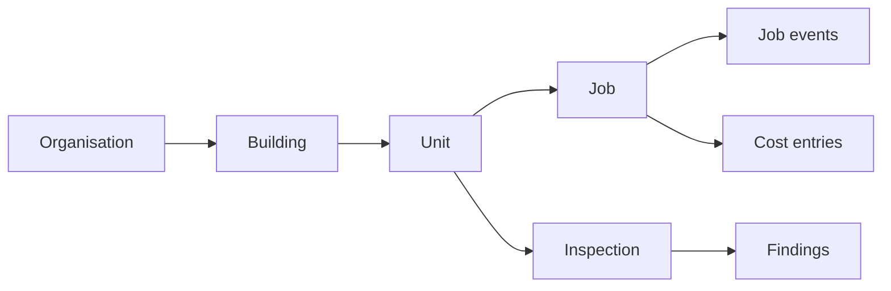

# Architecture

**This document is the binding contract.** It records the non-negotiables. Read
it before changing anything structural, and change it deliberately rather than
letting the code drift away from it.

## 1. What PropFix is

Building maintenance and inspection software for people who manage property —
managing agents, landlords with a portfolio, body corporates, facilities teams.

It runs as **one static binary and one SQLite file**. No cloud account, no
subscription, no external service. A tablet, a laptop, an office NAS or a
Raspberry Pi is a complete deployment.

Two products in one, and the second is the differentiator:

- **Maintenance** — raise a job against a unit, triage it, assign it, cost it,
  close it, and report spend per building and per unit.
- **Inspections** — templated condition capture, with **ingoing/outgoing
  comparison** so damage liability at move-out is evidence-based rather than
  argued.

## 2. Non-negotiables

1. **It works offline.** A contractor in a basement, a manager walking a block
   with no signal, an office whose line is down. Every surface accepts writes
   while partitioned and converges afterwards. Nothing blocks on the network.
2. **No central server is required.** Peers are enrolled by hand and sync
   directly. There is no hub, no control plane, and no account with us.
3. **The building is the unit of authority.** Whoever manages a building owns
   its jobs, its job numbering, and its inspections. This is what removes
   consensus from the design (§5).
4. **Money and quantities are append-only.** Never a stored counter. See §6 —
   this is the rule most likely to be broken by someone adding a feature.
5. **No hard dependency on relay, control plane, or DMTAP.** Optional seams
   only. Required by `VULOS-PRODUCT-STANDARD.md`.
6. **Cross-organisation work goes over WRAP** (§8), so a contractor running
   their own PropFix node is a first-class participant rather than a login on
   somebody else's system.

## 3. Stack

| Layer | Choice | Why |
|---|---|---|
| Language | Go 1.25 | House language; single static binary |
| Database | `modernc.org/sqlite` | Pure Go, no cgo — cross-compiles to arm64 |
| Router | `chi v5` | House convention |
| Frontend | React 19 + Vite + Tailwind | House convention |
| Maps | MapLibre + Protomaps | No API key, offline-capable tiles |
| Sync | HLC oplog (default), DMTAP-SYNC (opt-in seam) | §7 |
| Dispatch | WRAP `trades/v0` | §8 |
| Site | Hand-written, vendored `marked` + `mermaid` | Zero external fetches |

Money is `int64` **minor units**. Floats never touch money. This is not
negotiable and there is a test that fails if a `float64` appears in a money
path.

## 4. Domain model

### 4.1. Property hierarchy



**Unit is a real entity.** The legacy system stored units as free text on the
job (`unitIdentifier`) with no table, while its analytics grouped by that text —
so "Flat 3A", "3A" and "flat 3a" silently became three different units and
fragmented the per-unit cost reporting that is the product's main analytical
claim. Units are now rows, created on first use, with a normalised `key` and a
display `label`. Buildings keep a `unit_scheme` describing local numbering
convention, which drives normalisation rather than replacing it.

### 4.2. Core entities

| Entity | Notes |
|---|---|
| `organisation` | Tenancy boundary. Every row carries `org_id`. |
| `building` | `name`, `address`, `lat`, `lon`, `unit_scheme`. Lat/lon drive proximity ranking. |
| `unit` | `building_id`, `key` (normalised), `label` (as typed). |
| `job` | The work. Owned by its building (§5). |
| `job_event` | Append-only. Carries `visibility` — `public` is tenant-visible. |
| `cost_entry` | Append-only. `amount_minor`, `kind`. Never edited. |
| `time_entry` | Append-only. `minutes`. Never edited. |
| `inspection` | Linked to `building_id` **and** `unit_id`. |
| `inspection_template` / `_item` | Reusable checklists. |
| `finding` | Per-item condition, comment, photo refs. Append-only. |
| `attachment` | Content-addressed blob refs. |
| `party` | A person: staff, contractor, or tenant. Ed25519 key optional. |
| `peer` | An enrolled sync peer. |

### 4.3. Tenants

Tenants are **participants, not accounts**. A tenant is attached to a unit or a
job and sees only `visibility = 'public'` events. One thread serves both
internal notes and tenant communication, gated by that flag.

This model is inherited from the legacy system deliberately — it is the right
shape. A tenant should not need to hold a key, install anything, or create an
account to report a leak and be told it is fixed.

## 5. Authority

**The building is the authority.** Its owning organisation is the single writer
for:

- the job record and its **job number sequence** (namespaced per building, so
  numbers are allocated with no coordination);
- assignment;
- inspection scheduling.

Everything else is append-only and merges by union. Because the only contended
decision — who does the work — has exactly one legitimate writer, there is no
consensus protocol, no leader election, and no distributed lock anywhere in
this system.

## 6. Money and hours are append-only

`cost_entry` and `time_entry` rows are **immutable and insert-only**. A job's
cost is `SUM(amount_minor)` at read time. It is never a stored column.

This is the rule that makes offline work correct. If two people record spend on
the same job while partitioned, union merge means the amounts **add**. A stored
`cost` column would silently keep whichever write landed last and lose the
other — with no error, and no way to notice until the numbers were wrong.

A correction is a new entry with a negative amount, never an edit. The audit
trail is therefore complete by construction.

## 7. Sync

- **HLC stamps** — lexically sortable `{unix_ms:013d}-{counter:04x}-{author_hex}`.
  Ties break on **author public key**, never on a node identifier (this keeps
  the order a property of the object, so it survives relaying — and it is what
  makes the DMTAP binding lossless).
- **Rounds are stateless and symmetric** — push what the peer lacks, pull what
  we lack. Version vectors are derived from the oplog, so no per-peer state is
  stored and any node can relay any other node's operations.
- **Discovery is manual.** An operator enters the peer's URL. No mDNS, no DHT,
  no rendezvous.
- **Auth is mutual Ed25519** over a canonical envelope (method, path, body
  hash, timestamp, nonce) with a ±300s freshness window and a nonce cache. A
  shared secret bootstraps pairing via TOFU only; it is not the ongoing gate.
  Unenrolled peers are rejected by default.
- **File transport.** Each node appends only its own `ops-<node>.jsonl` to a
  shared folder, so a synced drive, a NAS or a **USB stick** is a valid
  transport with no possible write conflict.
- **Merge engine is a seam.** `store.Merger` — nil gives the built-in HLC
  engine; setting it swaps in DMTAP-SYNC. Chosen at boot, never mixed: two
  engines with different total orders cannot share a replica set.

## 8. WRAP

Work that leaves the organisation goes over **WRAP** (`trades/v0`), the open
work-coordination protocol. See `github.com/vul-os/wrap`.

| PropFix | WRAP |
|---|---|
| Managing agent / landlord | **Issuer** |
| In-house staff | Performer via direct offer (`mode = 0`) |
| External contractor | Performer, possibly via a pool |
| Tenant | Beneficiary — no key required |
| Job | `WorkOrder` (`profile: "trades/v0"`) |
| Quote | `Bid` with `Quote` |
| Job events | `Progress` |
| Sign-off | `Attestation` |

The point: a plumbing company runs **its own** PropFix node and receives work
orders from a managing agent's node. No platform sits between the landlord and
the plumber, and no one takes a cut.

WRAP is **optional**. In-house maintenance never touches it.

## 9. Layering

```
backend/
  cmd/propfix/        entrypoint, site embed, flags
  internal/
    store/            SQLite, migrations, HLC, oplog, Merger seam
    domain/           entities and invariants — no SQL, no HTTP
    repo/             one file per aggregate
    api/              chi routes, JSON, auth middleware
    sync/             peer transport, envelope auth, folder transport
    wrap/             WRAP binding — objects, signing, offers
    inspect/          templates, findings, comparison
    report/           aggregates
```

`domain/` MUST NOT import `repo/`, `api/` or `store/`. Dependencies point
inward. There is no god-service module; logic lives with its aggregate.

## 10. Migrations

Embedded via `embed.FS`, applied in order, each in **its own transaction**,
recorded in `schema_migrations (version, name, applied_at)`. No external tool.

Versions are numbered by **feature epoch** — `1`, `100`, `200`, `300` — with
`+1` for follow-ups inside an epoch. This leaves room to insert and makes the
list read as a changelog.

## 11. Security posture

- SQLite file is `0600`. `.gitignore` treats `*.db`, `*.sqlite*` and `.env` as
  hazards.
- Tenant isolation is enforced **server-side from the authenticated identity**.
  Scoping is never taken from a client-supplied parameter. (The legacy system
  trusted the frontend to send `organization_id` filters; that is not
  isolation.)
- Secrets are never logged, never in `String()`/`Debug` output, never in argv.
- No default outbound network calls. A fresh install talks to nothing.

## 12. Demo mode

`propfix --demo` seeds an in-memory dataset so the UI is fully browsable with
no database, no configuration and no signup. It is what the screenshotter runs
against, and it is the first thing a new contributor sees.

## 13. Status honesty

Anything partially built MUST say so where a reader will meet it — README
bullet, doc chapter, or UI. "Designed but not implemented" is an acceptable
state to ship; a feature that silently does nothing is not.
