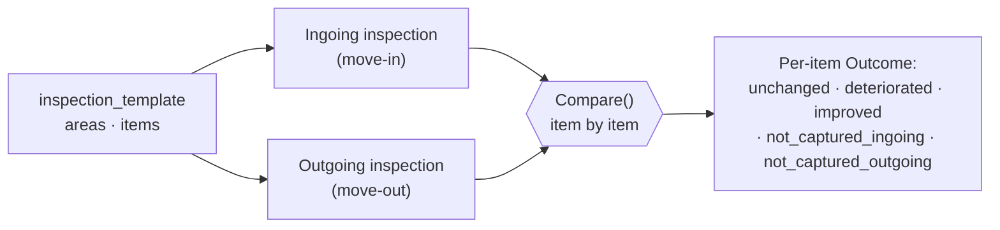

# Inspections

Inspections are the half of PropFix that is not a ticket system, and they are the
reason the product exists. Maintenance job tracking is a well-served category.
**Ingoing/outgoing condition comparison is not**, and it is where the money and
the arguments are.

## 1. The problem being solved

A tenant moves out. The agent says the kitchen counter was chipped during the
tenancy. The tenant says it was chipped when they moved in. Both are sincere.
Neither has evidence, because the ingoing inspection was a paper form in a
filing cabinet, photographed on a phone that has since been replaced, or filled
in as "condition: good" across forty line items in ninety seconds.

The deposit deduction that follows is not adjudicated on facts. It is adjudicated
on who is more insistent, or who can afford to escalate.

PropFix's claim is narrow and worth stating exactly: **it does not decide who is
right.** It makes the ingoing and outgoing captures structurally comparable, so
that the conversation is about evidence rather than recollection. If nobody
captured the counter on the way in, PropFix will show you that nobody captured
the counter on the way in.

## 2. Entities

From [ARCHITECTURE.md](ARCHITECTURE.md) §4.2, as implemented in
`internal/domain/domain.go` and `internal/repo/`:

| Entity | Notes |
|---|---|
| `inspection_template` | A reusable checklist. Owned by an organisation. |
| `inspection_template_item` | One line of the checklist, ordered (`sort`), grouped by area (`section`). |
| `inspection` | A run of a template. Linked to `building_id` always, and to `unit_id` when the kind requires one (see §4). Optionally linked to a `job_id` (§6). |
| `finding` | Per-item condition, comment, photo references. **Append-only.** |
| `attachment` | Content-addressed blob references — the photos. |

The `inspection` row links to a **real unit row**, not a free-text unit label.
This is the same fix described in [ARCHITECTURE.md](ARCHITECTURE.md) §4.1: if
inspections were keyed on typed text, "Flat 3A" and "3A" would be different
units, and an outgoing inspection would silently fail to find its ingoing
counterpart — the exact failure the feature exists to prevent.
`repo.CreateInspection` resolves a caller-supplied unit label through the same
`EnsureUnit` normalisation `repo.CreateJob` uses, so a job and an inspection
raised against the same physical door land on the same unit.

## 3. Templates

A template (`inspection_template`) is authored once per property type and
reused. Its shape, as shipped:

- **Areas** (`section`) — Kitchen, Bathroom, Bedroom 1, Exterior, Communal — a
  free-text grouping, not a fixed enum.
- **Items** (`inspection_template_item`) within an area — Counter, Sink, Taps,
  Tiling, Extractor — each carrying a `sort` order so a capture screen and a
  comparison report present the checklist in the same order it was authored.

There is no per-item photo-required or comment-required flag in the shipped
schema; every finding carries an optional comment and optional photo
references regardless of item or condition.

Templates are ordinary reference data: they replicate last-writer-wins by HLC
like buildings and units ([SYNC.md](SYNC.md) §3).

> **Open question, unchanged from the original design.** Editing a template
> that historical inspections were run against must not silently rewrite what
> those inspections meant. Versioning templates — an inspection pinning the
> template version it ran — is the obvious answer and is **not yet
> implemented**. In its absence, the comparison engine pairs items by
> normalised text rather than by template-item id precisely so that editing a
> template between an ingoing and an outgoing walk degrades gracefully instead
> of silently mispairing rows — see §5's "template drift" note. That is a
> mitigation, not a substitute for real versioning.

## 4. Kinds, status and capture

An inspection's `kind` is one of five, defined in `internal/domain/domain.go`:

| Kind | Requires a unit? | Purpose |
|---|---|---|
| `ingoing` | Yes | Move-in condition capture, the baseline for a later comparison. |
| `outgoing` | Yes | Move-out condition capture, compared against the matching `ingoing`. |
| `routine` | No | An ad hoc walk against a building or a unit. |
| `snag` | No | A defects-list walk, typically before handover. |
| `periodic` | No | A scheduled condition check outside a tenancy change — a body corporate's quarterly walk, a landlord's annual visit. Compares like `routine`: it has no counterpart it must be paired against. |

`ingoing` and `outgoing` are the only two kinds that require a unit —
`Inspection.Validate()` rejects either without one, because an inspection
recorded against the building as a whole can never be paired for comparison,
and would surface as a mysteriously empty result months later when a tenancy
is already in dispute.

Status moves through `scheduled` → `in_progress` → `complete`
(`InspectionScheduled`, `InspectionActive`, `InspectionComplete`). Capture must
work with **no signal**, because that is where it happens: a basement, a
stairwell, a block with no coverage, a building whose line is down. Nothing in
the capture flow blocks on the network.

Per item, a finding (`internal/domain.Finding`) records:

- **condition** — one of five values, ranked worst-to-best for the comparison
  engine: `ok`, `wear`, `damage`, `missing`, and `na` (not applicable — see
  §5, this one is deliberately *un*ranked);
- **comment** — free text, always optional;
- **photo_refs** — content-addressed attachment references, a plain string
  field (attachment linking is by convention, not a foreign key);
- **hlc** and **created_at**, so every observation is attributable and
  ordered.

Findings are **append-only** — there is no update path in `repo/finding.go`,
deliberately, for the same reason `cost_entry` and `time_entry` have none
(ARCHITECTURE.md §6). Correcting a finding writes a *new* finding; the
comparison engine reads the latest finding per item and the superseded row
stays in the record. If two inspectors capture the same item while
partitioned, union merge keeps both observations rather than the last write
silently discarding the other — in a dataset whose entire purpose is being
evidence.

### Completion is immutable

Once an inspection's status is `complete`, `SetInspectionStatus` rejects
**any** further status change — including a `complete → complete` no-op — and
`AddFinding` rejects any further finding against it. Both return `ErrConflict`
("inspection is complete and immutable" / "inspection is complete; findings
are closed").

This closes a hole the legacy system had: its completion handler set nothing
and rejected nothing, so a "completed" inspection could still be edited
underneath the record that was supposed to be the final one — which defeats
the entire evidentiary point of a move-out capture. The only way PropFix
corrects a completed inspection is the same way it corrects anything else
append-only: a new inspection, never a mutation of the old one.

Completing an inspection stamps `performed_at` if it is not already set,
because "when was this walked" is the question a deposit dispute turns on, and
reconstructing it from a finding's timestamp months later is not the same
answer.

## 5. Ingoing/outgoing comparison

The differentiator, implemented in `internal/inspect/compare.go` and exposed
at `GET /api/inspections/{id}/comparison`. The `{id}` names the **outgoing**
inspection; the handler resolves its ingoing counterpart server-side
(`repo.MatchingIngoing`, matched on `unit_id`) rather than accepting it as a
parameter, then runs `inspect.Compare` against the pair. The counterpart is
resolved server-side for the same reason org scoping is never taken from a
client-supplied parameter (ARCHITECTURE.md §11): letting a caller name both
sides would let it pair an outgoing inspection with an unrelated unit's
ingoing one and manufacture a comparison that never happened.

`Compare` requires the first inspection to be `kind = ingoing`, the second to
be `kind = outgoing`, and both to share a non-empty `unit_id` — anything else
returns `ErrMismatch`. The five outcomes, deliberately five rather than three:

| `Outcome` constant | Meaning |
|---|---|
| `unchanged` | Same condition both runs. |
| `deteriorated` | Condition is worse, per the ranked scale (`ok` < `wear` < `damage` < `missing`). The candidate deduction. |
| `improved` | Condition is better. It happens — a tenant replaces a broken blind. |
| `not_captured_ingoing` | There is no baseline. PropFix says so plainly rather than presenting it as deterioration. |
| `not_captured_outgoing` | The move-out run skipped the item. |

`na` (not applicable) is excluded from the ranked scale entirely: a fitting
that is `na` on one side and something else on the other has no comparable
direction, and `classify()` reports `unchanged` rather than guess one — the
conservative read, consistent with the rest of this section.

An item nobody captured on **either** side is dropped from the result — it is
an unused checklist line, not a comparison outcome, and showing it would bury
the findings that actually matter under empty rows.

### Template drift: how items are paired

Findings are paired across the two inspections by their **normalised
`(section, label)` text**, never by template-item id
(`internal/inspect/compare.go`'s `key()`). Ids are stable only within one
template row; if the template was edited or replaced between the ingoing and
the outgoing walk (§3's open versioning question), the item ids on the two
sides belong to two different rows, and pairing by id would either crash (id
absent on one side) or — worse — silently pair two unrelated rows that happen
to reuse a numeric offset.

Text is the actual claim being compared ("this is the kitchen counter, both
times"), and pairing on it degrades gracefully: an item whose label changed
shows up as not captured on one side rather than matched to the wrong item. A
freeform finding with no template item uses the same key, derived from its own
label.

### Fair-wear-and-tear

PropFix does **not** and will not decide what counts as fair wear and tear.
That is a legal and jurisdictional judgement, it varies by country and lease,
and a piece of software asserting it would be both wrong and unhelpfully
confident. The comparison surfaces the delta and the evidence; a human decides
what it means.

## 6. Job linkage

`inspection.job_id` (nullable, `internal/domain.Inspection.JobID`) optionally
links an inspection to a job in either direction:

- an inspection **scheduled to verify** a job — "confirm the leak repair
  before the tenant moves back in";
- an inspection that **prompted a job** — a periodic walk finds a deteriorated
  item and a job is raised to remedy it, so the cost of remediation lands next
  to the finding that prompted it.

Empty for a standalone inspection, which is the common case. `CreateInspection`
validates the referenced job exists and belongs to the caller's organisation
when `job_id` is set, the same way it validates `building_id`, `unit_id` and
`template_id`.

## 7. Reporting

Shipped:

- `GET /api/inspections/{id}/comparison` — the full item-by-item comparison
  for the id's unit, described in §5.

Not built:

- A packaged comparison export suitable for attaching to a deposit-return
  communication (the API response has everything such an export would need;
  rendering it as a document is a frontend/reporting concern that has not been
  built).

## 8. Status

| Piece | Status |
|---|---|
| Entity design (this document + ARCHITECTURE §4.2) | Shipped |
| Migrations for templates / inspections / findings (`store/migrations/300_inspections.sql`, `301_inspection_job_link.sql`) | Shipped |
| Template CRUD and item ordering | Shipped (`repo/template.go`) |
| Offline capture (create inspection, add finding) | Shipped (`repo/inspection.go`, `repo/finding.go`) |
| Completion immutability | Shipped (§4) |
| Comparison engine | Shipped (`internal/inspect`, §5) |
| Comparison API endpoint | Shipped (`GET /api/inspections/{id}/comparison`) |
| Photo capture and content-addressed attachments | Partial — `photo_refs` is a plain string field; the attachment table and upload path are not covered by this document |
| Comparison report / export document | Designed, no code (§7) |
| Template versioning | **Open question** (§3) |
| Photo replication policy across peers | **Open question** — see [SYNC.md](SYNC.md) §11 |
