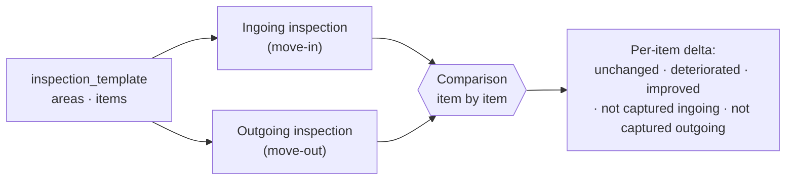

# Inspections

> [!WARNING]
> **📐 Designed, not implemented.** There is no inspection code, no template
> editor, no capture UI, and no comparison view in this repository. This chapter
> specifies the intended design.

Inspections are the half of PropFix that is not a ticket system, and they are the
reason the product exists. Maintenance job tracking is a well-served category.
**Ingoing/outgoing condition comparison is not**, and it is where the money and
the arguments are.

## 1. The problem being solved

A tenant moves out. The agent says the kitchen counter was chipped during the
tenancy. The tenant says it was chipped when they moved in. Both are sincere.
Neither has evidence, because the ingoing inspection was a paper form in a
filing cabinet, photographed on a phone that has since been replaced, or filled
in as "condition: good" across forty line items in ninety seconds.

The deposit deduction that follows is not adjudicated on facts. It is adjudicated
on who is more insistent, or who can afford to escalate.

PropFix's claim is narrow and worth stating exactly: **it does not decide who is
right.** It makes the ingoing and outgoing captures structurally comparable, so
that the conversation is about evidence rather than recollection. If nobody
captured the counter on the way in, PropFix will show you that nobody captured
the counter on the way in.

## 2. Entities

From [ARCHITECTURE.md](ARCHITECTURE.md) §4.2:

| Entity | Notes |
|---|---|
| `inspection_template` | A reusable checklist. Owned by an organisation. |
| `inspection_template_item` | One line of the checklist, ordered, grouped by area. |
| `inspection` | A run of a template. Linked to **`building_id` and `unit_id`** — both, always. |
| `finding` | Per-item condition, comment, photo references. **Append-only.** |
| `attachment` | Content-addressed blob references — the photos. |

The `inspection` row links to a **real unit row**, not a free-text unit label.
This is the same fix described in [ARCHITECTURE.md](ARCHITECTURE.md) §4.1: if
inspections were keyed on typed text, "Flat 3A" and "3A" would be different
units, and an outgoing inspection would silently fail to find its ingoing
counterpart — the exact failure the feature exists to prevent.

## 3. Templates

A template is authored once per property type and reused. Intended shape:

- **Areas** — Kitchen, Bathroom, Bedroom 1, Exterior, Communal.
- **Items** within an area — Counter, Sink, Taps, Tiling, Extractor.
- **Per item**: a condition scale, whether a photo is required, whether a comment
  is required when the condition is below a threshold.

Templates are ordinary reference data: they replicate last-writer-wins by HLC
like buildings and units ([SYNC.md](SYNC.md) §3).

> **Open question.** Editing a template that historical inspections were run
> against must not silently rewrite what those inspections meant. Versioning
> templates — an inspection pinning the template version it ran — is the obvious
> answer and is **not yet specified**. This is recorded here rather than
> discovered later.

## 4. Capture

Capture must work with **no signal**, because that is where it happens: a
basement, a stairwell, a block with no coverage, a building whose line is down.
Nothing in the capture flow may block on the network.

Per item, a finding records:

- **condition** on the template's scale;
- **comment** — free text, and required by the template where the condition is
  poor;
- **photos** — content-addressed attachment references;
- **author** and **HLC stamp**, so every observation is attributable and ordered.

Findings are **append-only**. Correcting a finding writes a *new* finding, it
does not edit the old one. This has the same justification as append-only money
([SYNC.md](SYNC.md) §4): if two inspectors capture the same item while
partitioned, union merge keeps both observations. A mutable "current condition"
field would keep whichever write landed last and silently discard the other —
in a dataset whose entire purpose is being evidence.

The consequence is that the audit trail is complete by construction. You can
always see what was recorded, by whom, when, and what superseded it.

## 5. Ingoing/outgoing comparison

The differentiator. An inspection is typed by its **purpose** — ingoing,
outgoing, periodic, or maintenance-related. An outgoing inspection on a unit can
be paired with the most recent ingoing inspection on the **same unit row**.

The intended per-item outcomes, and this list is deliberately five rather than
three:

| Outcome | Meaning |
|---|---|
| **Unchanged** | Same condition both runs. |
| **Deteriorated** | Condition is worse. The candidate deduction. |
| **Improved** | Condition is better. It happens — a tenant replaces a broken blind. |
| **Not captured ingoing** | There is no baseline. **PropFix must say so plainly and must not present this as deterioration.** This is the honest case the paper process quietly loses. |
| **Not captured outgoing** | The move-out run skipped the item. |

The last two matter more than the first three. A comparison view that renders
"no baseline" as if it were evidence of damage would be worse than no tool at
all, because it would launder a missing record into a confident-looking claim.

### Fair-wear-and-tear

PropFix does **not** and will not decide what counts as fair wear and tear.
That is a legal and jurisdictional judgement, it varies by country and lease,
and a piece of software asserting it would be both wrong and unhelpfully
confident. The comparison surfaces the delta and the evidence; a human decides
what it means.

## 6. Reporting

Intended outputs, none built:

- A **comparison report** per unit — item, ingoing condition + photos, outgoing
  condition + photos, delta, comments from both runs.
- Export suitable for attaching to a deposit-return communication.
- Linkage from a deteriorated item to a **job** raised to remedy it, so the
  cost of remediation is on the record next to the finding that prompted it.

## 7. Status

| Piece | Status |
|---|---|
| Entity design (this document + ARCHITECTURE §4.2) | 📐 Designed |
| Migrations for templates / inspections / findings | 📐 Designed, no code |
| Template editor UI | 📐 Designed, no code |
| Offline capture UI | 📐 Designed, no code |
| Photo capture and content-addressed attachments | 📐 Designed, no code |
| Comparison engine | 📐 Designed, no code |
| Comparison report / export | 📐 Designed, no code |
| Template versioning | **Open question** (§3) |
| Photo replication policy across peers | **Open question** — see [SYNC.md](SYNC.md) §11 |
