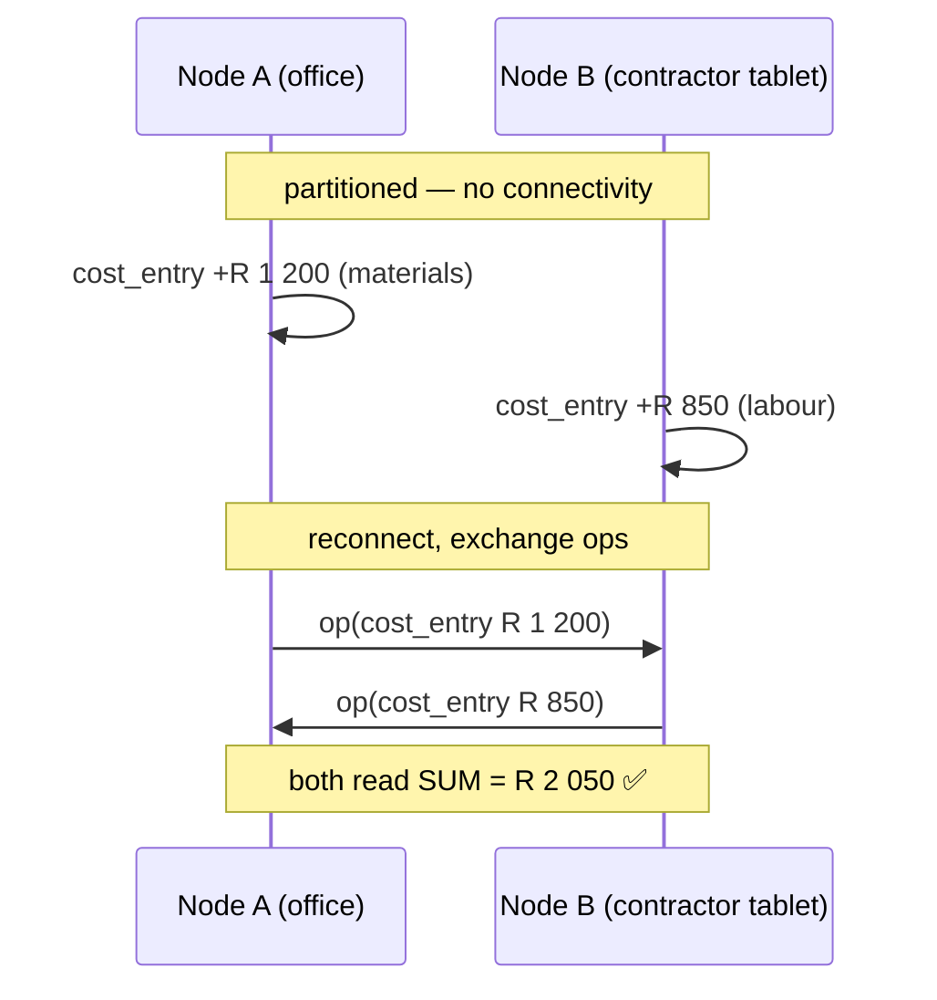
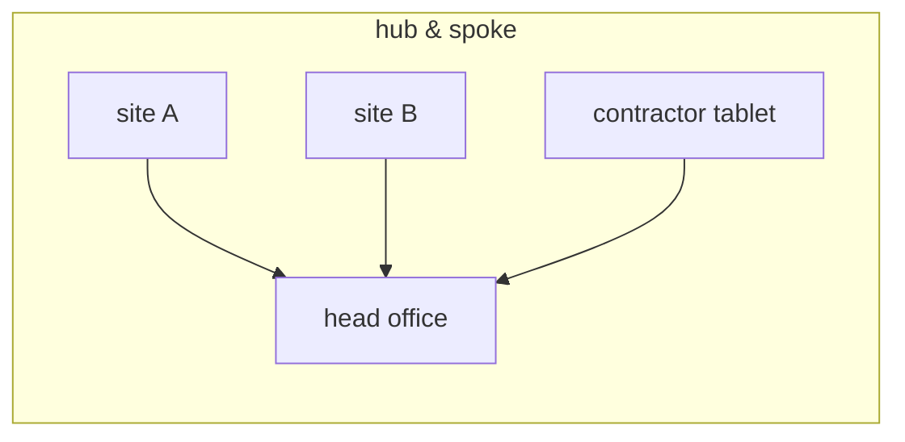

# Sync

> [!WARNING]
> **📐 Designed, not implemented.** No sync code exists in this repository yet.
> This chapter is the protocol specification the rebuild is being written
> against — it is a design document, not a description of running software.
> Where a decision is still open, it says so rather than picking silently.

PropFix's sync is built around one requirement from
[ARCHITECTURE.md](ARCHITECTURE.md) §2: **a node must keep working with no
connectivity at all**, and still end up consistent with every other node later.
A contractor in a basement, a manager walking a block with no signal, an office
whose line is down. There is no central server and no primary node — replication
is leaderless and peer-to-peer.

## 1. Mental model

- Every install is a **node** with its own SQLite database.
- Every change is journalled as an **op** stamped with a hybrid logical clock
  (HLC) that is unique and causally ordered.
- Syncing = exchanging ops. Ops are **idempotent**; applying the same op twice
  is a no-op. Any node can relay any other node's ops.

That last property is what makes the topology free: a node does not need to know
where an op came from to pass it on correctly.

## 2. HLC stamps

A stamp is a lexically sortable string:

```
{unix_ms:013d}-{counter:04x}-{author_hex}
```

- `unix_ms` — 13 zero-padded digits, so string order is time order until the
  year 33658.
- `counter` — a monotonic counter within the same millisecond.
- `author_hex` — the **author's Ed25519 public key**.

Sorting the string sorts the ops. No parsing is required to order a batch.

### Why ties break on the author key

An exact `(wall, counter)` tie breaks on the **author public key**, never on a
node identifier. This is not a stylistic choice; it has two consequences that
are load-bearing:

1. **The order is a property of the object.** An op carries everything needed to
   place it. It therefore survives being relayed through a third node, stored in
   a file, and re-imported months later — the order never depends on who handed
   it to you.
2. **The DMTAP-SYNC binding is lossless.** The substrate engine breaks ties on
   the author public key too. Because PropFix's node id **is** its public key,
   the two engines break ties on the same value.

The Vulos suite learned this the hard way: two products independently built
engines that both converged correctly and still disagreed about who won, because
one broke ties on a node id and the other on a key. Two engines with different
total orders cannot share a replica set. Hence the rule in
[CONFIGURATION.md](CONFIGURATION.md): the merge engine is a **deployment-wide
switch, never a gradual rollout.**

### Clock skew

The HLC tolerates skewed wall clocks — an observed timestamp pushes the local
clock forward — but keep node clocks roughly sane (NTP) so that "newest wins"
matches human expectation. A wildly fast clock does not corrupt anything; it
just wins arguments it should not have won.

## 3. What merges how

This is the section most likely to be broken by someone adding a feature. Read
it before adding a table.

| Data | Merge rule | Why |
|---|---|---|
| `cost_entry` | **Union.** Immutable, insert-only. | Two people recording spend on the same job while partitioned must **add**. See §4. |
| `time_entry` | **Union.** Immutable, insert-only. | Same argument as cost. |
| `job_event` | **Union.** Append-only. | A thread is the union of what everyone said. Nothing is ever retracted, only superseded by a later event. |
| `finding` | **Union.** Append-only per inspection item. | A condition capture is an observation with a time and an author. It is never edited. |
| `job` (the record) | **Single writer** — the owning organisation of the building. | See §5. |
| Job number sequence | **Single writer**, namespaced per building. | Numbers allocate offline with no coordination. |
| Assignment | **Single writer.** | The only contended decision in the product. |
| Inspection scheduling | **Single writer.** | Same authority. |
| `building`, `unit`, `party`, `inspection_template` | **Last-writer-wins** per row, by HLC. | Reference data. The newest edit wins on every node. |
| Deletions of reference data | **Soft** — a `deleted` flag, replicated like any other write. | A hard delete cannot replicate, and a permanent tombstone would swallow a later re-creation of the same row. |
| `attachment` | **Content-addressed.** Union of references; blobs fetched by hash. | Two nodes that capture the same bytes converge on one blob for free. |

### The soft-delete trap

Some CRDT vocabularies offer a *strong* delete that no later write can undo,
meant for redactions and expiries. Using it for ordinary rows looks correct in
every test that only ever deletes — and then silently swallows the next write to
that row, on every node at once, with no error anywhere. PropFix does not use
it. A test that deletes a unit and re-creates it with the same key exists to keep
that true.

## 4. Money and hours: why append-only is a sync decision

`cost_entry` and `time_entry` are immutable and insert-only, and a job's cost is
`SUM(amount_minor)` at read time. **It is never a stored column.**

Consider two people costing job #412 while partitioned:



With a stored `cost` column and last-writer-wins, one of those two amounts is
gone — no error, no conflict marker, no way to notice until the numbers are
wrong at month end. Union merge over immutable facts makes the correct answer
the *only* representable answer.

A correction is a **new entry with a negative amount**, never an edit. The audit
trail is therefore complete by construction: you can always see what was
recorded, by whom, when, and what corrected it.

Money is `int64` **minor units** everywhere. Floats never touch a money path,
and there is a test that fails if a `float64` appears in one.

## 5. Authority: why there is no consensus protocol

**The building is the authority.** Its owning organisation is the single writer
for the job record, the job-number sequence, assignment, and inspection
scheduling.

Everything else is append-only and merges by union. Because the only genuinely
contended decision — *who does the work* — has exactly one legitimate writer,
there is **no consensus protocol, no leader election, and no distributed lock
anywhere in this system.**

This mirrors WRAP's central insight (see [WRAP.md](WRAP.md)): the party who
wants the work done is already the natural authority over who does it. Removing
the race removes the arbiter, and removing the arbiter removes the server.

A contractor's node can *propose* — progress events, costs, findings, all
append-only — but it does not reassign a job. If it needs to hand work back, it
says so as an event and the owning organisation acts on it.

## 6. Rounds are stateless and symmetric

A sync round with one peer both **pushes** what the peer lacks and **pulls** what
we lack. So:

- Only **one side of any pair needs to be reachable**. The tablet behind CGNAT
  dials the office; the office never needs to reach the tablet.
- **No per-peer state is stored.** Version vectors are *derived from the oplog*
  at round time, not maintained as a table that could drift out of step with the
  log it describes.
- Because no per-peer state exists and ops are self-ordering, **any node can
  relay any other node's operations**.

### Topologies

Anything works, because ops relay transitively:

- **Pair** — an office and a tablet; one dials the other.
- **Hub and spoke** — head office is reachable; every site lists only head
  office. Sites still receive each other's changes through the hub.
- **Mesh** — everyone lists everyone. Most resilient, most configuration.



## 7. Discovery is manual

An operator enters the peer's URL. **No mDNS, no DHT, no rendezvous service, no
directory.** There is nothing to enumerate and nothing to scan for.

This is a deliberate cost: adding a peer takes a human action. In exchange, a
PropFix node on a hostile network advertises nothing, and there is no discovery
infrastructure to compromise, subpoena, or shut down.

## 8. Transport and authentication

Sync endpoints (`/api/sync/*`) live on the app's own HTTP port. There is no
separate sync port.

### The signed envelope

Every sync request is signed with the caller's node key over a canonical
envelope:

| Field | Purpose |
|---|---|
| `method` | Prevents a signed GET being replayed as a POST. |
| `path` | Prevents retargeting a valid signature at another endpoint. |
| `sha256(body)` | Body tampering breaks the signature. |
| `timestamp` | Unix seconds; ±300s freshness window. |
| `nonce` | Random; cached for the freshness window. |

The responder:

1. checks the timestamp is **fresh** — rejecting stale and future-dated
   requests;
2. looks up the **public key it recorded** for the caller's node id and verifies
   against *that* key, never the key the caller presents — so a caller cannot
   impersonate an enrolled node by presenting its own key;
3. rejects a **replayed** `(node, nonce)` seen inside the window.

### The shared secret is a bootstrap, not a gate

A shared secret has exactly one job: **pairing.** A node that has not yet
enrolled a key proves it knows the secret, which authorises the responder to
record (trust-on-first-use) the key it presents. From that moment the node
authenticates **by key**, and the secret is no longer consulted for it.

An optional `PROPFIX_SYNC_SECRET_FALLBACK` lets an already-enrolled peer keep
authenticating by secret alone. It defaults to **off**, so an enrolled peer that
presents no valid signature is **rejected — the mesh fails closed.**

With no secret set and no enrolled key, every request is rejected. **Unenrolled
peers are rejected by default.**

### Threat table

| Threat | What stops it |
|---|---|
| A stranger on the network reaching `/api/sync/*` | No shared secret to bootstrap and no enrolled key → rejected. |
| A captured request replayed later | Freshness window plus the replay-nonce cache. |
| A tampered body, or a signature retargeted at another path | Body hash, path and method are inside the signed envelope. |
| Impersonating an enrolled node | Verification uses the **recorded** key, not the presented one. |
| A former contractor whose peer row you deleted | Their key no longer verifies. Full revocation = **delete the peer row *and* rotate the pairing secret**, since the secret alone would let them bootstrap a fresh key. |
| Someone who learns the pairing secret | They can enrol a *new* key, but cannot forge requests as an *existing* enrolled node. Rotate the secret to stop new enrolments. |
| Two unrelated organisations sharing a secret by accident | Every row and op carries `org_id`; foreign ops are dropped on apply regardless of transport auth. |

### What the signatures do **not** do

Signatures authenticate peers. They do **not encrypt the payload.** Sync traffic
is your maintenance data — job detail, tenant names, unit addresses, costs. Run
it on a trusted path:

- a LAN;
- a VPN or overlay you run yourself (WireGuard, Tailscale, Netbird);
- an HTTPS tunnel — a [Vulos Relay](https://github.com/vul-os/vulos-relay) is
  one option, and is an **optional convenience only**. Nothing about sync
  depends on it, and a relay is a content-visible L7 hop: it terminates TLS and
  can see what passes through. Treat it as reachability, not confidentiality.

Peer URLs may be `http://` or `https://`. PropFix will not stop you using plain
HTTP on a LAN, because on a LAN that is often the correct call — but it is your
call, made knowingly.

## 9. Folder transport — files as a wire

Networking is not the only way to replicate. Point every node at a shared folder
— Syncthing, a NAS mount, a synced drive, or a **USB stick**:

- Each node appends **only its own** ops to `ops-<node>.jsonl`. Because every
  node owns exactly one file, **no file ever has two writers**. There is nothing
  to merge and no conflict to resolve — the file-sync tool cannot get it wrong.
- Each node periodically **imports every other** `ops-*.jsonl` through the same
  idempotent apply path used by network sync. Imports are incremental (a byte
  offset per file) and consume only whole lines, so a file still being written is
  read safely up to its last complete line.
- The files are **transport, never truth.** The database is authoritative. The
  files are a durable, replayable log; a brand-new node pointed at the folder can
  rebuild from the files alone.

This needs no ports, no reachability, and no simultaneous connectivity. Two
nodes never have to be online at the same time.

### Sneakernet

For a site with no shared network at all:

1. On node **A**, set the sync folder to the stick and run a folder sync. A
   writes `ops-<A>.jsonl` and imports anything already there.
2. Carry the stick to node **B**. Set B's folder to the stick and sync. B
   imports A's file and writes its own.
3. Carry it back. A imports B's file. Both have converged.

Because the files are append-only and applying an op twice is a no-op, it does
not matter how often the stick is carried, in what order, or whether a trip is
skipped. Every node converges once the bytes reach it.

## 10. The merge engine is a seam

`store.Merger` is an interface. Leaving it `nil` gives the built-in HLC engine.
Setting it swaps in **DMTAP-SYNC**, the shared substrate engine, so PropFix does
not maintain a private sync algebra forever.

The choice is made **at boot and never mixed**. See the caution in
[CONFIGURATION.md](CONFIGURATION.md#merge-engine--designed): two engines with
different total orders cannot share a replica set, and the failure is silent
divergence rather than an error.

The precondition that makes the swap safe is already in the design: a node's id
**is** its public key, so both engines break an exact tie on the same value.

## 11. Open questions

Recorded honestly rather than decided by omission.

- **Compaction.** The oplog grows with history. A snapshot-and-prune design
  (prune only what every enrolled peer has acknowledged, always keeping the
  newest op per origin so the version vector never regresses) is the obvious
  shape, but it is **not specified here yet** and not implemented.
- **Attachment replication.** Blob references merge by union; the *transfer*
  policy — fetch eagerly, lazily, or on demand, and what a node does when a blob
  it references is unavailable — is not settled.
- **Inspection photo volume.** A full move-out inspection is dozens of photos.
  Whether these ride the folder transport or are fetched separately is an open
  operational question, not a solved one.
- **Verifying convergence.** A state-root style content address over the whole
  replicated state (including tombstones and anything no screen displays) would
  let two nodes prove they agree rather than eyeball it. Desirable; unspecified.
