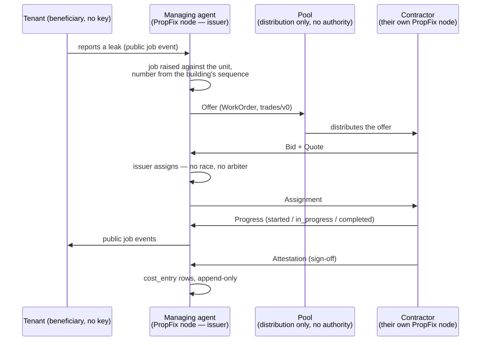

# PropFix and WRAP

> [!WARNING]
> **📐 Designed, not implemented.** There is no `wrap/` package in this
> repository yet — no object encoding, no signing, no offer flow, no pool
> client. This chapter specifies the binding so it can be reviewed against the
> WRAP spec before code exists.
>
> WRAP itself is a separate, independently specified protocol:
> [`github.com/vul-os/wrap`](https://github.com/vul-os/wrap). Where this
> document and the WRAP specification disagree, **the specification wins** and
> this document is the bug.

## 1. Why PropFix speaks somebody else's protocol

In-house maintenance never needs it. A managing agent with in-house staff runs
one node, and everything stays inside the organisation.

The moment work crosses an organisational boundary, though, the usual answer is
a platform: the contractor gets a login on the agent's system, or both get
logins on a third party's, and that third party holds every job record, every
identity, and every reputation — and takes a cut.

WRAP's observation is that centralisation there is a business model wearing the
costume of an architecture. Look at what actually forces a central operator and
it is one thing: **somebody must decide who gets the job.** Most platforms run
first-come-claim — broadcast, race, first tap wins. A race needs an arbiter. An
arbiter is a server. Everything else gets absorbed into it because it is already
there.

WRAP removes the race: **the issuer assigns.** The only contended decision is
made by the party who is already its natural authority — the one who wants the
work done.

This is *the same rule* PropFix already applies internally, where the building is
the authority for assignment ([SYNC.md](SYNC.md) §5). PropFix does not adopt
WRAP because it needs a network; it adopts WRAP because WRAP is the same idea,
already specified, already open, and already implemented by parties who are not
us. Inventing a parallel one would be exactly the "no parallel inventions" rule
the VulOS product standard forbids.

The point, in one line: **a plumbing company runs its own PropFix node and
receives work orders from a managing agent's node. No platform sits between the
landlord and the plumber, and no one takes a cut.**

## 2. Role mapping

| PropFix | WRAP |
|---|---|
| Managing agent / landlord / body corporate | **Issuer** |
| In-house staff | Performer, via a direct offer (`mode = 0`) |
| External contractor | Performer, possibly reached via a pool |
| Tenant | **Beneficiary** — no key required |
| Job | `WorkOrder`, `profile: "trades/v0"` |
| Quote | `Bid` carrying a `Quote` |
| Job events | `Progress` |
| Sign-off | `Attestation` |

The tenant row is the one worth pausing on. A tenant is a **participant, not an
account** — in PropFix and in WRAP alike. They hold no key, install nothing, and
create no account in order to have a leak fixed and be told it was fixed.

## 3. The flow

Note what is **not** in that diagram: no platform account, no escrow, no
settlement, no central job database. WRAP is not a payment system — a work order
carries compensation *terms* as data, and settlement happens out of band by
whatever means the parties already use.

## 4. `trades/v0`, and why it is the right profile

WRAP ships two v0 profiles. `delivery/v0` is immediate, single-visit,
fixed-price. `trades/v0` is skilled work at a site: scheduled, often multi-visit,
frequently re-quoted after inspection.

Property maintenance is squarely the second. The profile's fields map onto the
PropFix job almost directly:

| WRAP field | Key | PropFix meaning |
|---|---|---|
| `trade` | 32 | `"plumbing"`, `"electrical"`, `"hvac"`, `"carpentry"`, … — the job's trade |
| `licence` | 33 | Required credential (e.g. `"za:pirb"`) where the work demands one |
| `visit` | 34 | `0` quotation, `1` work, `2` follow-up — the reason a callout is not one event |
| `materials` | 35 | `{label, qty, cost}` — feeds `cost_entry` rows on receipt |
| `access` | 36 | Site access: key collection, occupant presence, gate codes |

- `Place.role` is `"site"` — the building, positioned by the `lat`/`lon` PropFix
  already stores for proximity ranking.
- `Window.kind` is `1` (scheduled appointment). This is the field that makes
  trades expressible at all; an immediate-only model cannot say "Tuesday
  morning, tenant will be home".
- Fulfilment is a **beneficiary signature** where the tenant is present, and
  `kind = 4` with a note where they are not — which, for property work, is
  common and must not be an error case.

The WRAP spec is explicit that including `trades/v0` in v0 was deliberate:
designing against delivery alone produces a core that silently assumes work is
immediate, single-visit and fixed-price. Every one of those assumptions is false
for a plumber. PropFix is a direct beneficiary of that decision.

## 5. Offers, pools, and what a pool is not

- **Direct offer (`mode = 0`).** Where the relationship already exists — in-house
  staff, or the plumber the agent has used for nine years — the offer goes
  straight to the performer. No pool is involved. This is expected to be the
  common case in property management, where contractor relationships are
  long-lived.
- **Pool distribution.** Where it does not, an offer goes to a pool. **A pool
  distributes; it does not decide.** It has no authority over assignment, holds
  no identity, and cannot take a cut of a decision it does not make. Anyone can
  run one, you can join several, and losing one costs reachability — never
  identity, history, or data.

That property is what keeps this from being a platform with extra steps.

## 6. What crosses the boundary, and what does not

This is a privacy boundary, not just a protocol boundary, and PropFix must treat
it as one.

| Stays inside the organisation | Crosses to the performer |
|---|---|
| Internal job events (`visibility != 'public'`) | The work order: site, trade, description, window, access |
| Full cost breakdown across the portfolio | The compensation terms for *this* work order |
| Other units, other jobs, other buildings | Nothing about them |
| Tenant contact detail beyond what the visit needs | Only what the visit needs |
| The oplog | Nothing — WRAP objects are **not** app-state replication |

That last row is a rule from the VulOS product standard: **sync travels the sync
path; cross-boundary messaging carries communication, never app-state
replication.** PropFix must never smuggle oplog entries through WRAP objects.
Two contractors on the same pool must not be able to reconstruct an agent's
portfolio.

## 7. Identity and reputation

A WRAP identity is an **Ed25519 keypair held by the participant**, not by a
platform. PropFix nodes already generate exactly such a keypair on first run for
sync ([CONFIGURATION.md](CONFIGURATION.md#identity--designed)).

Whether the WRAP identity and the sync node key are the **same key** is an
**open decision, not yet made.** Sharing one key is simpler and means a
contractor has one identity everywhere; separating them limits blast radius if
one is compromised and avoids correlating a node's sync peers with its public
work history. This document will record the decision when it is made rather than
letting the first implementation choose it by accident.

`Attestation` objects are signed by counterparties and held by **both** sides, so
a contractor's record travels with them. Leave a pool and your history comes
with you — because it was never the pool's to hold.

## 8. Honest limits

Taken from WRAP's own statement of what it is not, because a doc that only lists
strengths is a sales page:

- **Not trustless.** Open participation admits Sybils. WRAP makes the trust
  source explicit and replaceable — curated pools — rather than pretending the
  problem is solved. Vetting a contractor is still your job.
- **Not anonymous.** WRAP protects the integrity and ownership of history, not
  metadata privacy. A pool sees the offers routed through it.
- **Not a payment system.** No escrow, no currency, no chain. If the contractor
  is not paid, WRAP has no opinion about it.
- **Not a mesh.** Work orders are point-to-point plus pools. Broadcasting them
  would publish tenant addresses to strangers.

## 9. Implementation status

| Piece | Status |
|---|---|
| Role and profile mapping (this document) | 📐 Designed |
| `wrap/` package — object model, CBOR encoding, signing | 📐 Designed, no code |
| Direct offers (`mode = 0`) | 📐 Designed, no code |
| Pool client | 📐 Designed, no code |
| `Progress` ⇄ job-event binding | 📐 Designed, no code |
| `Attestation` ⇄ sign-off | 📐 Designed, no code |
| WRAP identity ⇄ node key decision | **Open** |
| Conformance against the WRAP test vectors | Not started |

WRAP support is **optional** and off by default
(`PROPFIX_WRAP`). A PropFix deployment that never sends work outside the
organisation never touches any of it.
